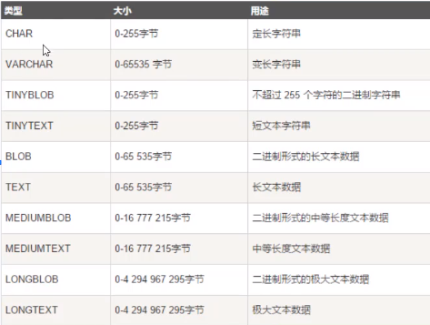

### SQL、功能分类及数据类型 ###
- 什么是SQL
	- SQL是Structured Query Language（结构化查询语句）的缩写。
	- SQL是专为数据库而建立的操作命令集，是一种功能齐全的数据库语言。
	- 在使用它时，只需要发出“做什么”的命令，“怎么做”是不用使用者考虑的。
- sql功能分类
	- DDL数据定义语言：用来定于数据库对象：创建库、表、列等。
	- DML数据操作语言：用来操作数据库表中的记录
	- DQL数据查询语言：用来查询数据
	- DCL数据控制语句：用来定义访问权限和安全级别

- SQL数据类型
	- MySQL中定义数据字段的类型对你数据库的优化是非常重要的。
	- MySQL支持所有标准SQL数值数据类型。
	- MySQL支持多种数据类型，大致可以分为三类
		- 数值类型
			
		- 字符串类型
			
		- 日期和时间类型
			
	- 常用数据类型
		- double：浮点型，例如double(5,2)表示最多5位，其中必须有2位小数，即最大值为999.99
		- char：固定长度字符串类型，例如char(10) 'abc  '
		- varchar：可变长度字符串类型，例如varchar(10) 'abc'
		- text：字符串类型
		- blob：二进制类型
		- date：日期类型，格式为：yyyy-MM-dd
		- time：时间类型，格式为：hh:mm:ss
		- datetime：日期时间类型yyyy-MM-dd hh:mm:ss
	- 在MySQL中，字符串类型和日期都要用单引号起来。例如，'Myxq','2020-01-01'