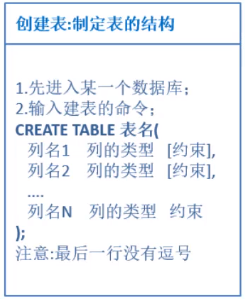

### DDL数据定义语言 ###
- 创建数据库
	- create database 数据库名 character set utf8;
	- 例如：create database my_test character set utf8;
- 修改数据库
- 创建学生表

	

	例如：

		show databases;
		use my_test;
		CREATE TABLE student(id int, name varchar(25), email varchar(255), age int);
		show tables;
		desc student;
	
- 添加一列
	- ALTER TABLE 表名 ADD 列名 数据类型;
	- 例如：ALTER TABLE student ADD score double(5,2);
- 查看表的字段信息
	- DESC 表名;
	- 例如：desc student;
- 修改一个表的字段类型
	- ALTER TABLE 表名 MODIFY 字段名 数据类型;
	- 例如：ALTER TABLE student MODIFY id bigint;
	- 例如：ALTER TABLE student MODIFY score double(4,1);
- 删除一列
	- ALTER TABLE 表名 DROP 字段名;
	- 例如： ALTER TABLE student DROP age;
- 修改表名
	- RENAME TABLE 原始表名 TO 要修改的表名;
	- 例如： RENAME TABLE student TO students;
- 查看表的创建细节
	- SHOW CREATE TABLE 表名;
	- 例如：SHOW CREATE TABLE students;
- 修改表的字符集为gbk
	- ALTER TABLE 表名 CHARACTER SET 字符集名称;
	- 例如：ALTER TABLE students CHARACTER SET gbk;
- 修改表的列名
	- ALTER TABLE 表名 CHANGE 原始列名 新列名 数据类型;
	- 例如：ALTER TABLE students CHANGE email Email varchar(25);
- 删除表
	- DROP TABLE 表名;
	- 例如：DROP TABLE students;